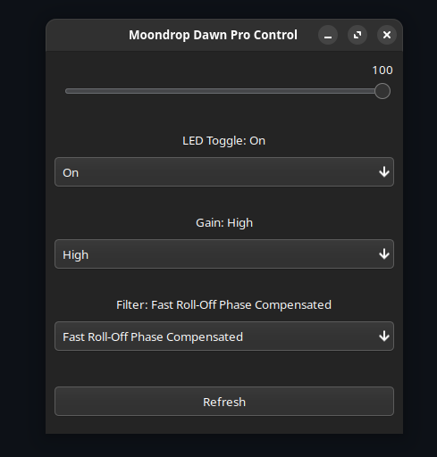

# DawnPro-Utils
DawnPro-Utils is a tool used to control the Moondrop Dawn Pro AMP/DAC.



## Features

- Change the LED status (on, temp-off, off)
- Set the gain (low, high)
- Configure the filters:
    - Fast-roll-off-low-latency
    - Fast-roll-off-phase-compensated
    - Slow-roll-off-low-latency
    - Slow-roll-off-phase-compensated
    - Non-oversampling
- Adjust the volume

## Requirements

- Python
- `usb` module
- `PyGObject`

## Installation

To install the required Python modules, run:

```sh
pip install pyusb PyGObject
```

## Setup

Add the following rule to your udev rules:

```sh
SUBSYSTEM=="usb", ATTRS{idVendor}=="2fc6", MODE="0666"
```

## Usage

To run the tool, execute the following command:

```sh
python main.py
```

## Acknowledgments
inspired by:

"mdrop" by frahz: https://github.com/frahz/mdrop/ 
